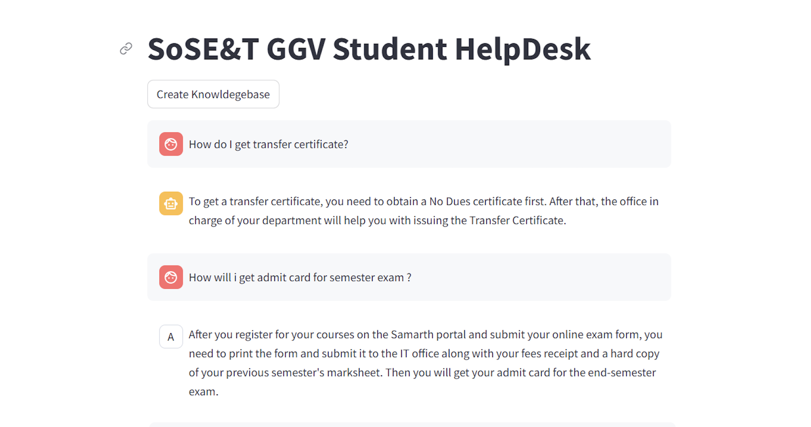

# 🎓 Student Support Chatbot (RAG-based)

A Retrieval-Augmented Generation (RAG) chatbot built to assist students with campus-related queries using a custom FAQ dataset. This chatbot uses semantic search over vector embeddings generated from CSV data and returns smart answers using LLMs.



---

## 📂 Project Structure
```
student_support.chatbot.rag/
│
├── faiss_index/           # Prebuilt FAISS vector index files
├── ggv_faqs.csv           # Dataset containing campus FAQs
├── main.py                # Main script to launch the chatbot
├── requirements.txt       # Python dependencies
└── Chatbot.png            # Screenshot of the UI
```
---

## 🧠 Features

- RAG-based retrieval using FAISS
- Natural language question answering using Hugging Face Transformers
- Lightweight and fast — ideal for student helpdesks
- CSV-based FAQ ingestion

---

## ⚙️ Installation

1. **Clone the repository**
```bash
git clone https://github.com/arpitpatelsitapur/student_support.chatbot.rag.git
cd student_support.chatbot.rag
```
	
2.	Create virtual environment
```
python -m venv venv
source venv/bin/activate  # On Windows: venv\Scripts\activate
```
	
3.	Install dependencies
```
pip install -r requirements.txt
```

## 🚀 Usage
1.	Make sure ggv_faqs.csv contains your FAQ data.
2.	Run the chatbot:
```
python main.py
```

Note: Make sure faiss_index/ is present or build the index using a script (if available).

## 📦 Dependencies

Some key libraries (see requirements.txt for all):
- transformers
- sentence-transformers
- faiss-cpu
- pandas
- streamlit or flask (if UI is involved)

## 💾 Data Format

Your ggv_faqs.csv should look something like:
```
question	                           | answer
-------------------------------------------------------------------------
How to apply for hostel?	           | Visit the hostel office…
Where is the admin block located?	   | Next to the main gate…
```

---
